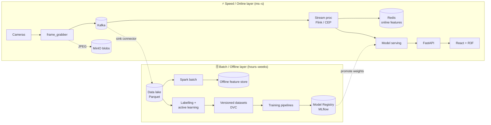
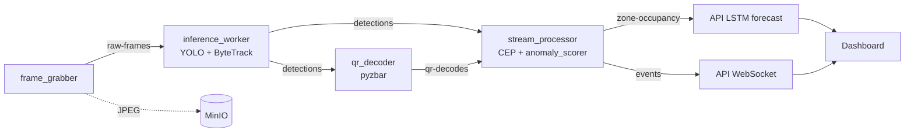
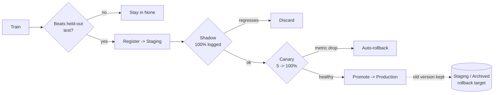

# LOGIVISION — Layered (Lambda) Architecture

> Soutenance reference. Describes the system as a **layered architecture**
> with a **Lambda** split (real-time *speed* layer + batch *offline* layer).
> The current demo runtime is one concrete instantiation; every box names
> its production upgrade path so the design scales without changing the
> contracts (Kafka topics, bucket layout, registry names).

---

## 0. The one-sentence model

> Video and sensor streams flow through an **ingestion → stream-processing →
> serving → delivery** path in real time (the *speed layer*), while the same
> events are continuously dumped to a **data lake** and re-processed in batch
> to retrain models (the *batch layer*); the two meet at the **feature store**
> and the **model registry**.

---

## 1. The seven layers

| # | Layer | Role | Demo runtime | Production target |
|---|---|---|---|---|
| 1 | **Ingestion** | Capture frames/sensors, split video into images, publish events | `frame_grabber` (2–5 fps, JPEG) | RTSP ingest workers, autoscaled |
| 2 | **Transport / Bus** | Durable, ordered, replayable event log | **Kafka** (KRaft, 1 broker) + Schema Registry (Apicurio) | Multi-broker Kafka, multi-region |
| 3 | **Storage** | Blobs + lake + online/offline feature stores | **MinIO** (frames, artifacts) | S3 + Redis (online) + Parquet lake (offline) |
| 4 | **Stream Processing** | Real-time enrichment, windowed aggregation, feature computation | Python **CEP** (`cep.py`) | **Flink** (`services/flink-jobs/`) |
| 5 | **Model Serving** | Load weights from registry, run inference | In-process (`inference_worker`, API LSTM, `anomaly_scorer`) | **BentoML / Triton / KServe** |
| 6 | **Delivery / API** | Fan out predictions to clients | **FastAPI** (REST + WS + MJPEG) | API gateway + WebSocket cluster |
| 7 | **Presentation** | Operator dashboard + 3D digital twin | **React + R3F** (Vite SPA) | same, CDN-served |

Cross-cutting layers (touch all seven):
- **MLOps / Training plane** — MLflow registry, DVC datasets, training pipelines.
- **Observability** — Prometheus (metrics) + Grafana (dashboards) + MLflow (experiments) + drift reports.

---

## 1b. Slide-ready diagrams (Mermaid)

> These render directly on GitHub and export cleanly for soutenance slides.
> ASCII equivalents are kept in §2–§3 for terminals that don't render Mermaid.

### Layered + Lambda overview



### Real-time data flow (topics)



### Model promotion lifecycle



---

## 2. The Lambda split (why "online" *and* "offline")

```
                          ┌──────────── SPEED / ONLINE LAYER (ms–s) ────────────┐
  Cameras ─► frame_grabber ─► Kafka ─► Stream proc (Flink/CEP) ─► Serving ─► API ─► UI
                  │              │            │
                  ▼            (claim         ▼
              MinIO blobs      check)   ONLINE feature store (Redis)
                  │
                  │  Kafka sink connector (always-on plumbing)
                  ▼
  ┌──────────── BATCH / OFFLINE LAYER (hours–weeks) ─────────────────────────────┐
  Data lake (Parquet on MinIO/S3) ─► Spark batch ─► OFFLINE feature store
        │                                              │
        ▼                                              ▼
  Labelling + active learning ─► versioned datasets (DVC) ─► Training pipelines
                                                            │
                                                            ▼
                                          Model Registry (MLflow): None→Staging→Prod
                                                            │
                                                            └─► back to Serving (top)
```

- **Speed layer**: low-latency, approximate, serves *now*. Kafka → Flink/CEP → serving → API.
- **Batch layer**: complete history, high-accuracy, rebuilds *truth*. Lake → Spark → training.
- **Serving/reconciliation**: the **feature store** holds the same feature in two stores
  (Redis online for sub-ms reads, Parquet offline for point-in-time-correct training sets);
  the **model registry** is where a batch-trained model becomes the online server's weights.

**This is Lambda.** The simpler alternative is **Kappa** (one streaming engine; "batch" = replay
the Kafka log). Trade-off: Lambda = two codepaths to keep in sync; Kappa = simpler but needs
long Kafka retention + a powerful stream engine. *Defense line:* "We chose Lambda because our
batch needs (full-dataset retraining, dataset versioning) differ structurally from streaming;
Kappa is the consolidation path once retention and Flink are in place."

---

## 3. Data flow, end to end (what each topic carries)

```
frame_grabber ──raw-frames──► inference_worker ──detections──► qr_decoder ──qr-decodes──┐
   │ (JSON pointer)              │ (YOLO + ByteTrack)              │ (pyzbar on crop)     │
   ▼                            │                                 ▼                      ▼
 MinIO (JPEG pixels)            └──detections──► stream_processor (CEP + anomaly_scorer) ◄┘
                                                       │            │
                                              zone-occupancy      events
                                                       │            │
                                                       ▼            ▼
                                              API LSTM forecast   API WebSocket ─► UI
```

| Topic | Producer | Payload | Consumer |
|---|---|---|---|
| `raw-frames` | frame_grabber | `{frame_id, camera_id, minio_key, ts}` (pointer, **not pixels**) | inference_worker |
| `detections` | inference_worker | boxes + `track_id` (ByteTrack) per frame | qr_decoder, stream_processor |
| `qr-decodes` | qr_decoder | decoded `ZONE_ID:CATEGORY_ID` + bbox | stream_processor |
| `zone-occupancy` | stream_processor | per-zone occupancy ratio (0–1) on a time grid | API (LSTM) |
| `events` | stream_processor | anomaly / entry / exit / forecast events | API → WebSocket → UI |

**Kafka ingest, concretely**: every service uses a Kafka client library. A producer calls
`produce(topic, key=camera_id, value=json)`; Kafka appends to a **partition** chosen by the key
(so one camera stays ordered). Consumers in a **group** split partitions and commit **offsets**,
so a crash resumes exactly where it stopped — that is why Kafka sits between *every* pair of
services: it decouples their failure domains. **Pixels never go through Kafka** (claim-check
pattern): the JPEG goes to MinIO, Kafka carries the key.

---

## 4. The storage layer in detail

| Store | Type | Latency | Holds | When used |
|---|---|---|---|---|
| **MinIO `frames` bucket** | object store | ~ms | JPEG frames | inference fetches each frame by key |
| **MinIO `mlflow` bucket** | object store | — | model artifacts | registry resolves weights |
| **Data lake (Parquet on MinIO/S3)** | columnar lake | batch | all historical events | training-set curation, Spark |
| **Redis (online feature store)** | KV cache | sub-ms | latest feature per entity | online inference lookup |
| **Offline feature store (Parquet)** | columnar | batch | feature history | build training sets (point-in-time) |
| **Postgres** | RDBMS | ms | MLflow/app metadata | registry + experiment metadata |

Key idea: **Kafka is transport, not a database** (retention = days, not queryable). To make
events trainable they are *materialized*: a **sink connector** continuously writes topics to the
lake as date-partitioned Parquet → that lake is the "DB used for training".

---

## 5. The three models — independent lifecycles, composed by topics

| | **Box detection** | **Congestion forecast** | **Trajectory anomaly** |
|---|---|---|---|
| Paradigm | Supervised (+ Noisy Student) | Self-supervised regression | **Unsupervised** reconstruction |
| Model | YOLOv8 + ByteTrack | 2-layer LSTM | GRU autoencoder |
| Training data | Kaggle labels + pseudo-labels | Birmingham occupancy ratios | Pipeline's own normal trajectories |
| Imbalance/label handling | per-class P/R + pseudo-labelling | none (regression) | **no labels** — threshold on recon error |
| Gate to Production | mAP@0.5 beats teacher | RMSE beats persistence baseline | percentile-threshold sweep vs CEP baseline |
| Served from | MLflow Registry → inference_worker | committed artifact → API | committed artifact → stream_processor |
| Retrain cadence | weekly (new footage) | monthly | when footage accumulates |

They coexist because they're **decoupled by topics**, not coupled in code. No model knows the
others exist; each upgrades independently as long as its topic schema holds. The one real
coupling: the anomaly model trains on the detector's output, so a major detector change should
trigger anomaly-model revalidation (lineage-aware trigger).

### How "anomaly" handled the label/imbalance problem
Anomalies are rare + undefined → supervised would face extreme imbalance *and* no labels at once.
The **GRU autoencoder sidesteps both**: train to reconstruct only *normal* motion, score live
windows by reconstruction MSE, flag above the 99th/99.5th validation percentile. The CEP rules
(stationary, box-falling) are kept as the **labelled baseline** the article compares against.
**Student–teacher (Noisy Student) is a *different* technique for the *detector*** — it scales up
the *supervised* model when warehouse labels are scarce (teacher pseudo-labels unlabeled footage,
bigger student trains on real + pseudo, promoted only if it beats the teacher on a held-out set).

---

## 6. The MLOps lifecycle — train / test / deploy / change

```
  curate dataset (lake + active learning, DVC-versioned)
        │
        ▼
  TRAIN  (notebook / pipeline, logged to MLflow)
        │
        ▼
  EVALUATE on held-out test split  ──fails gate──► stop, stays in None
        │ passes
        ▼
  REGISTER → Staging         (registry version N+1)
        │
        ▼
  SHADOW  (100% traffic, outputs logged only)  ──regresses──► discard
        │ matches/beats
        ▼
  CANARY  (5%→25%→50%→100%, auto-rollback on metric drop)
        │ healthy
        ▼
  PROMOTE → Production   ──► serving layer hot-swaps weights on restart
        │
   (old version demoted to Staging/Archived — kept for ROLLBACK, never deleted)
```

- **When does the model change?** Only at an explicit, gated promotion — never silently
  mid-stream. Trigger maturity ladder: **manual → scheduled → volume-triggered → drift-triggered**
  (Continuous Training).
- **Is history stored? Yes, forever.** Registry keeps every version + lineage (run → dataset
  version → code commit); lake keeps all data; each prediction is stamped with the model version.
  Reasons: rollback (re-promote previous version), audit/reproducibility (EU AI Act), drift debugging.
- **Choosing the model in the first place** — three-stage funnel:
  1. **Architecture comparison** (`compare-archs`): train all candidates on identical splits,
     compare on a **Pareto frontier of accuracy vs latency vs size**.
  2. **Runtime benchmark** (`benchmark`): FP32/FP16/INT8, PyTorch/ONNX/OpenVINO, p50/p95/p99 latency.
  3. **Promotion gates**: beat current Production on held-out test + golden-set regression + latency budget.

### Shadow vs canary (concretely)
- **Shadow** = new model sees **100%** of live traffic, outputs **logged not shown**. Zero user
  risk; validate against the live distribution before anyone sees it.
- **Canary** = new model serves a **small slice** of real traffic that *is* used; an automated
  monitor compares canary vs stable metrics; a regression auto-rolls-back to the previous registry
  version. Risk bounded to the slice.

---

## 7. Active learning — how labelling actually scales

```
  model predicts on new frames  ──►  uncertainty score per frame
        │                                   │
        │                     uncertainty sampling: pick top-N ambiguous
        │                     (low confidence / 2-model disagreement /
        │                      near decision boundary)
        ▼                                   ▼
  cheap frames skipped              humans label ONLY those (CVAT)
                                            │
                                            ▼
                                add to dataset → retrain → repeat
```

Same accuracy with **5–10× fewer labels**, because annotation budget stops being spent on easy,
redundant frames. This is how the supervised detector's training set grows without an army of
annotators.

---

## 8. QR / barcode decoding — placement and purpose

- **Where**: `qr_decoder` service, downstream of detection. Consumes `detections`, crops the
  code's bbox from the MinIO JPEG, runs `pyzbar` (native `libzbar`) on the crop. Runs in
  parallel; never blocks the detector.
- **How it works**: deterministic, no ML. `libzbar` finds the symbology's finder patterns,
  binarizes, locates and decodes the payload. Output = string (e.g. `DOCK-A:FRAGILE`) + type +
  position.
- **What it feeds**: the CEP, as the **authoritative identity/zone** ("a box" → "carton #4471 in
  zone DOCK-A"). It overrides the geometric zone guess and stamps entry/exit events with real IDs.

---

## 9. The 3D digital twin (R3F)

A **decision-support visualization layer**, not (yet) a physics simulation. An abstract 3D layout
(explicitly labelled "abstract layout") onto which live state is projected: zones light by
occupancy, anomalies appear where they occur, the congestion forecast colors a zone *before* it
fills. Value: spatial state at a glance vs parsing event lists.
**Upgrade path (future work)**: a true simulation — replay/forecast flows, "what-if" re-routing —
which is when "digital twin" becomes literal.

---

## 10. Delivery layer + observability

- **Architecture style**: **microservices**. Each stage is an independent process/container,
  decoupled by Kafka topics, scaled and failed independently. The API gateway is *one* service
  (REST + WebSocket + MJPEG) — a thin fan-out over the topics, not a monolith doing ML.
- **How predictions reach the UI**: the API is a Kafka **consumer** of `events`; it pushes each
  event over **WebSocket** to browsers (push, not poll). Video is **MJPEG** (multipart HTTP).
  Aggregates (`/api/kpis`, `/api/predictions`) are REST, computed on demand.
- **Failure handling** (graceful degradation, never fabrication): registry down → cached weights →
  baseline → honest "unavailable"; LSTM artifact missing → rule forecast; < 12h history →
  `insufficient-history`; poison messages → dead-letter queue; crashed service → Kafka retains +
  offsets resume.
- **Monitoring stack** (distinct jobs, you want all):
  - **DVC** — *dataset versioning* (reproducibility), **not** runtime monitoring.
  - **Prometheus** — metrics scraping (latency, consumer lag, error rate).
  - **Grafana** — dashboards + alerting on those metrics.
  - **MLflow** — experiment/model history.
  - **Evidently-style drift report** — input/prediction drift → can trigger retraining.

---

## 11. The plumbing — how layers actually connect

No magic; four mechanisms:
1. **Client libraries (SDKs)** — `produce()`→Kafka wire protocol; `put_object()`→HTTP/S3 to MinIO;
   `MlflowClient`→REST. ~90% of all movement.
2. **Connectors (zero-code)** — Kafka Connect for DB↔Kafka↔lake; **Debezium** CDC tails a DB's
   write-ahead log into Kafka; Flink reads/writes Kafka via its built-in connector. Config, not code.
3. **APIs between services** — REST/gRPC when one service explicitly asks another (API↔serving,
   services↔registry).
4. **Containers + orchestration** — Docker packages services; Kubernetes runs/scales/restarts;
   service discovery resolves `kafka:9092`. Docker hosts the boxes; it doesn't move the data.

**The architecture lives in the contracts** (topic schemas, bucket layout, registry names), not in
the transport. Nail the contracts and any box is swappable — CEP→Flink, MinIO→S3, processes→pods —
without redesigning the system.

---

## 12. Soutenance cheat-sheet

- **Pattern**: layered + **Lambda** (speed + batch), reconciled at feature store + registry.
- **Kappa** is the consolidation path; named on purpose.
- **3 models, 3 paradigms** (supervised / self-supervised / unsupervised), independent lifecycles,
  composed by Kafka topics.
- **Anomaly = unsupervised autoencoder** (no labels, threshold on reconstruction error);
  **student-teacher = the *detector's* label-scarcity trick**, a different thing.
- **Kafka = transport, not DB**; the lake (sink connector) is the trainable history.
- **Promotion is gated + reversible**: shadow → canary → promote; old versions kept for rollback.
- **DVC ≠ monitoring**; Prometheus + Grafana do live health, MLflow does model history.
</content>
</invoke>
