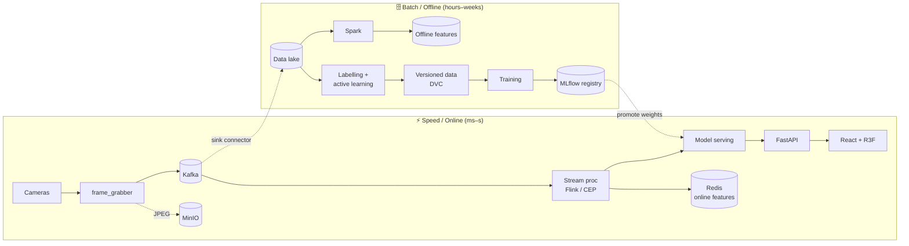
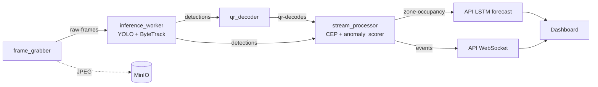

# Welcome to LOGIVISION

> Real-time warehouse computer-vision platform.
> Video → Kafka → YOLO + ByteTrack → QR → CEP → live operator dashboard.

**This is the single source of truth for the project** — onboarding guide,
architecture reference, roadmap, contribution workflow, and licenses, all in
one file. Read top-to-bottom; jump to **Get Started** at the bottom when
you're ready to run the demo. (The old `ARCHITECTURE.md`, `PROJECT_PLAN.md`,
`CONTRIBUTING.md`, and `NOTICE.md` were folded in here; their history is in
git if you need the originals.)

---

## Your Setup Checklist

### Codebases
- [ ] **logivision_v2** — main repo, default branch `main`, protected
  (PR required, status checks must pass).

### Local prerequisites
- [ ] **Docker Desktop** running (for Kafka, MinIO, MLflow, CVAT stacks).
- [ ] **uv** for Python deps: `brew install uv`.
- [ ] **Node 20+** for the React/Vite frontend.
- [ ] **zbar** for QR decoding: `brew install zbar`.
- [ ] **kaggle** CLI if you want to retrain: `pip install kagglehub` + add `~/.kaggle/kaggle.json`.

---

## 1. What this project is

A **streaming computer-vision pipeline** for warehouse monitoring:

- **Camera feeds** (synthetic warehouse videos for the demo; real RTSP cameras in production) flow into Kafka.
- A YOLOv8 model fine-tuned on warehouse data **detects** every box / person / forklift.
- **ByteTrack** assigns persistent IDs across frames so we can ask *"is this the same carton that arrived 30 s ago?"*.
- **pyzbar** decodes any QR / barcode in the frame, turning a sticker into an authoritative `ZONE_ID:CATEGORY_ID`.
- A **CEP module** runs 5 rules: stationary object, zone violation, entry, exit, box-falling.
- Events stream over WebSocket to a **React + R3F dashboard** where operators see live MJPEG feeds, anomaly cards, and a 3D warehouse layout.

It's not a research-only pet project. Every visible number on the dashboard traces to a real Kafka topic or YAML config — no synthetic / random data passing as model output. Honest about what's a rule vs what's a trained model.

---

## 2. Architecture in one diagram

```
   Cameras (mp4 / RTSP / webcam)
        │
        ▼
  frame_grabber  ──►  raw-frames topic ──►  inference_worker  ──►  detections topic
                            │                  (YOLOv8 + ByteTrack)         │
                            │                                               │
                            │                                               ├─► qr_decoder  ──►  qr-decodes topic
                            ▼                                               ▼
                          MinIO                              stream_processor (Python CEP)
                       (JPEG frames                                         │
                        + MLflow artifacts)                                 ▼
                                                                   events topic
                                                                            │
                                                                            ▼
                                                            FastAPI gateway (api/)
                                                                            │
                                                       ┌────────────────────┴──────────────────┐
                                                       ▼                                       ▼
                                                /api/cameras/{id}/stream.mjpg              /ws/events
                                                  (live video feed)                       (event stream)
                                                       │                                       │
                                                       └─────────► React frontend (Vite)◄──────┘
                                                                   Tiles · Twin · Anomalies
```

Production target on the side: PyFlink jobs (`services/flink-jobs/`) that share
the same schema. The Python CEP is the demo runtime; Flink is the upgrade path.

---

## 3. Service map

| Service | Purpose | Key file |
|---|---|---|
| **frame_grabber** | Reads video/RTSP/webcam, JPEG-encodes, uploads to MinIO + publishes `raw-frames` | `services/frame_grabber/grabber.py` |
| **inference_worker** | Consumes `raw-frames`, runs YOLOv8 + ByteTrack, publishes `detections` | `services/inference_worker/worker.py` |
| **qr_decoder** | Consumes `detections`, runs pyzbar on bbox crops, publishes `qr-decodes` | `services/qr_decoder/decoder.py` |
| **stream_processor** | Python CEP: stationary / zone / entry / exit / box-falling rules → `events` | `services/stream_processor/cep.py` |
| **flink-jobs** | PyFlink production-target jobs (not deployed, schema-aligned) | `services/flink-jobs/` |
| **api** | FastAPI gateway: REST + WS + MJPEG streaming | `services/api/main.py` |
| **model_server** | MLflow Registry resolution (`resolve_model_weights`) + BentoML host | `services/model_server/service.py` |
| **frontend** | Vite + React + R3F SPA — operator + admin views | `frontend/src/` |

---

## 4. Data flow (read this if nothing else)

1. **Source video** sits in `datasets/raw/taltech_videos/Camera3.mp4` (real TalTech synthetic warehouse) and `datasets/raw/pexels_warehouse/*.mp4` (curated Pexels stand-ins for the other 4 cameras). Bootstrap with `make camera-videos` → creates `Camera1.mp4`..`Camera5.mp4` symlinks under `datasets/raw/videos/`.
2. **`frame_grabber`** reads the chosen video at 2-5 fps, JPEG-encodes each frame, uploads to MinIO bucket `frames`, publishes a small JSON message to Kafka `raw-frames` (key = `frame_id`).
3. **`inference_worker`** consumes `raw-frames`, fetches the JPEG from MinIO, runs YOLOv8 (loaded from MLflow Registry → Production, falls back to local `yolov8n.pt`), then **ByteTrack** to attach persistent `track_id`. Publishes one message per frame to `detections`.
4. **`qr_decoder`** (optional, parallel) consumes `detections`, for any detection whose `class_name ∈ {qr_code, barcode, ...}` it crops the bbox + runs `pyzbar`, publishes the decoded payload to `qr-decodes`. CEP downstream treats decoded zones as authoritative.
5. **`stream_processor`** (CEP) consumes `detections` (and `qr-decodes` when present), evaluates 5 rules with stateful per-track tracking, emits events to the `events` topic.
6. **`api`** subscribes to `events` and fans out over `/ws/events` WebSocket to connected operator browsers. It also serves the React SPA from `/`, MJPEG streams from `/api/cameras/{id}/stream.mjpg`, and admin endpoints.

---

## 5. The 5 CEP rules

| Rule | Triggers when | Severity |
|---|---|---|
| `stationary_object` | Track's centroid stays in a 25 px radius for ≥ 30 s | warning |
| `zone_violation` | Track centroid enters a polygon with `kind: forbidden` in `infra/zones.example.yaml` | critical |
| `entry` | Track first enters a zone with `kind: entry` (powers Entrées KPI) | info |
| `exit` | Track first enters a zone with `kind: exit` (powers Sorties KPI) | info |
| `box_falling` | Within a 1-s window: aspect-ratio Δ ≥ 0.6 AND centroid_y Δ ≥ 10 % frame height | critical |

Each rule has cooldown to avoid spam. Defaults are in `services/stream_processor/cep.py::CEPConfig`. All 5 are pure functions backed by unit tests.

---

## 6. What's a real trained model vs what's a rule

Honest summary:

| Feature | Reality |
|---|---|
| **Object detection** | **Trained model** — YOLOv8n fine-tuned on Kaggle warehouse-delivery-box, mAP@0.5 measured on the held-out test split |
| **Object tracking** | **Library** — ByteTrack from the `trackers` package (Roboflow), no training required |
| **QR decoding** | **Library** — `pyzbar` wrapping native `libzbar`, deterministic |
| **Stationary / entry / exit / zone-violation / box-falling** | **Rule-based CEP** — geometric + temporal heuristics, not ML |
| **Congestion forecast** (visible on dashboard) | **Trained model** — 2-layer LSTM trained on **UCI Beijing Multi-Site Air-Quality (PRSA)** (33 MB, public). Inputs: 24-h rolling window of hourly readings per node. Output: occupancy 1 / 3 / 6 h ahead. RMSE / MAE reported on the held-out test split. Domain-transferred to warehouse zone occupancy at inference time. See `ml/notebooks/05_congestion_lstm.ipynb`. |
| Collision risk (visible on dashboard) | **Rule-based** — two stationary events same zone within 30 s. Future-work upgrade path: LightGBM trained on MOT17-derived near-misses (5 GB, deferred — explicitly noted in the paper's "Future Work" section). |

**Why this asymmetry**: the congestion model is the trained one because UCI PRSA (33 MB, no auth, ~5 min CPU training) fits the 3-day budget. The collision-risk LightGBM would need MOT17 (~5 GB) — explicitly deferred. We do NOT train on synthetic data we made up; the paper would not survive review.

The dashboard surfaces this distinction clearly:
- **Congestion ETA panel** badge: `LSTM · PRSA-transferred · v1`
- **Collision risk panel** badge: `rule v0 · upgrade to LightGBM in roadmap`

---

## 7. Three-day sprint plan

### Day 1 — done ✅ (7 commits live)

| ID | Task | Commit |
|---|---|---|
| D1.A | Colab-ready YOLO training notebook | `9655001` |
| D1.B | ByteTrack integration in inference_worker | `727ace2` |
| D1.C | QR/barcode decoder service | `702da61` |
| D1.D | Box-falling CEP rule | `14473e7` |
| D1.E | Camera1-5 video mapping + setup script | `0155b16` |
| D1.F | MLflow Registry artifact-path fix | `7fdba43` |
| D1.G | Branch protection on `main` | (GitHub UI) |

50 unit tests passing (CEP × 26, worker × 12, QR × 12).

### Day 2 — to do

| ID | Task | Note |
|---|---|---|
| D2.1 | Promote Colab-trained model to Production | `make register-from-colab RUN=<name>` after Colab finishes |
| D2.2 | Frontend visual polish | Camera tile header icons, sidebar accents, anomalies feed coloring, REC indicator |
| D2.3 | Notebook 01 — data preprocessing | EDA, OBB→AABB, splits, augmentation, DVC, CVAT workflow |
| D2.4 | Notebook 04 — accuracy evaluation | Real metrics on hand-labelled ground truth (mAP, MOTA, IDF1, QR success, entry/exit P/R) |
| **D2.4b** | **Notebook 05 — congestion LSTM on UCI PRSA** | **Trained model: 2-layer LSTM, RMSE / MAE on held-out test split, transfer methodology to warehouse zones documented.** |
| D2.5 | GitHub Actions CI (ruff + pytest) | Required status check for branch protection |
| D2.6 | Integration test (full pipeline on Camera3.mp4) | Asserts ≥ 1 event of each type |
| D2.7 | Repo cleanup pass + this ONBOARDING.md becomes the only doc | Delete 5 scattered docs in `docs/` |
| D2.8 | `make demo` single-command target | Brings up the full stack |
| **D2.9** | **Wire the LSTM output into the dashboard's Congestion panel** | **Replace the rule-based forecast with the model output; flip the panel badge to "LSTM · PRSA-transferred · v1".** |

### Day 3 — to do

| Task | Note |
|---|---|
| Execute notebooks 01-04 end-to-end, commit with outputs | Reviewer sees plots & metrics without running anything |
| Final ONBOARDING.md polish (this file) | Soutenance defense Q&A section |
| `docs/screenshots/` — 4 high-quality screenshots | One per persona |
| Smoke test on a clean machine (`make clean && make bootstrap && make demo`) | Catches missing setup steps |
| Tag `v1.0-soutenance` | Frozen release for the defense |

---

## 8. How to run the demo

Once you've completed the Setup Checklist:

```bash
# 1. Bring up the infra (MinIO, MLflow, Postgres, Kafka)
make bootstrap        # MinIO + MLflow + Postgres
make kafka-up         # Kafka KRaft single-broker

# 2. Create the per-camera video symlinks (Camera1-5.mp4)
make camera-videos

# 3. Build the frontend bundle (once)
make frontend-install && make frontend-build

# 4. Start the API (serves frontend at http://localhost:8000)
make api

# 5. In separate terminals, run the pipeline:
make frame-grabber SOURCE=datasets/raw/videos/Camera3.mp4 CAMERA=CAM03 FPS=2
make inference-worker
make qr-decoder
make cep ZONES=infra/zones.example.yaml
```

Open `http://localhost:8000` — Cameras view loads by default. CAM03 will show real Kafka-sourced bounding boxes (warehouse-trained YOLO output). Other cams show video without overlays until you start a `frame_grabber` for them.

For training a fresh YOLO model:
```bash
make train                      # local CPU (~4 h)
# OR open ml/notebooks/00_colab_training.ipynb on Colab T4 (~25 min)
# Once Colab finishes and you've unzipped best.pt into ml/runs/<name>/weights/:
make register-from-colab RUN=<name>
make worker-restart             # picks up the new Production model
```

---

## 9. Useful URLs while running

| | URL | Notes |
|---|---|---|
| Operator dashboard | http://localhost:8000 | Default landing = Caméras view |
| Admin view | same URL with `LOGIVISION_ROLE=admin make api` | Adds the *Système* tab |
| MLflow | http://localhost:5050 | Experiment runs + model registry |
| MinIO | http://localhost:9001 | `logivision` / `change-me-in-local-minimum-8-chars` |
| Kafka UI | http://localhost:8086 | Topics, consumer lag, message inspection |
| CVAT (annotation) | http://localhost:8080 | After `make cvat-up` |

---

## 10. The model & dataset

- **Dataset on disk**: Kaggle `zoya77/warehouse-delivery-box-detection-dataset` (361 train / 99 val / 61 test images, aerial warehouse boxes). Pulled via `kagglehub`; converted from YOLO-OBB to standard AABB by `scripts/prepare_kaggle_warehouse.py`.
- **Classes (3)**: `box_small`, `box_medium`, `box_large`.
- **Model**: YOLOv8n fine-tuned from COCO weights. Hyperparams pinned in `ml/configs/yolov8n.yaml`.
- **Tracker**: ByteTrack via `trackers.ByteTrackTracker`, one instance per `camera_id`. Defaults: `track_activation_threshold=0.25`, `minimum_consecutive_frames=2`, `frame_rate=5`.
- **Evaluation**: Notebook 04 (Day 2) reports mAP@0.5 / mAP@0.5:0.95 / per-class P/R on the held-out test split, plus tracking MOTA/IDF1 on a 30-s hand-labelled Camera3 clip.

---

## Team Tips

A few things that aren't in the code but will save you a session of confusion:

1. **`main` is protected.** Direct pushes are blocked. Every change is a PR; the `backend-tests` status check must pass; only owners can merge. If a hook reformats your files after staging, you'll see *"Everything up-to-date"* with no error — re-stage and re-commit.
2. **Run `make camera-videos` after every fresh clone.** The `Camera1.mp4`..`Camera5.mp4` symlinks live under `datasets/raw/` which is gitignored. Without them the streaming endpoint serves a 404.
3. **If the worker logs `Loading model: yolov8n.pt (fallback:yolov8n.pt)`**, that means MLflow has no Production version. Run `make register-from-colab RUN=<dir>` once your Colab training finishes, then `make worker-restart`.
4. **macOS + pyzbar gotcha**: `pyzbar` won't find `libzbar` unless `DYLD_LIBRARY_PATH=/opt/homebrew/opt/zbar/lib` is exported. The `make qr-decoder` target handles this — never run `python -m services.qr_decoder.decoder` directly.
5. **The dashboard's badges (LSTM vs rule v0) are intentional.** Congestion is the trained LSTM; collision is the rule-based fallback. Don't quietly upgrade collision to look ML-flavoured before training the LightGBM (future work).
6. **Pre-executed notebooks**: the `.ipynb` files in `ml/notebooks/` are committed *with their outputs*. Re-running them locally will overwrite plots and may produce different numbers — wrap experimental edits in a branch.

---

## Get Started

**Starter task: explore the frontend and pick one thing to polish.**

The fastest way to understand LOGIVISION is to bring it up and click through every view.

```bash
# 1. Clone + dependencies
git clone <repo-url>
cd logivision_v2
make install              # uv sync
make frontend-install     # npm install in frontend/

# 2. Local infra (Docker Desktop must be running)
make bootstrap            # MinIO + MLflow + Postgres
make kafka-up             # Kafka KRaft

# 3. Camera videos (symlinks regenerated from the curated source files)
make camera-videos

# 4. Front-end bundle + API (serves at http://localhost:8000)
make frontend-build
make api &

# 5. Open the dashboard
open http://localhost:8000
```

Click through these views in order — the sidebar is the navigation:

1. **Caméras** (default) — 5 tiles. CAM03 streams the real TalTech synthetic-warehouse video; others stream Pexels stand-ins. Overlays show real Kafka detections **when the pipeline is running** (we'll start it in a second). Status badges: `live · kafka` (green) = inference flowing, `feed only` (electric blue) = video plays but no worker.
2. **Vue d'ensemble** — KPI strip + the 3D R3F twin (labelled "abstract layout" so nobody confuses it with a CAD reconstruction). Click a zone to highlight it.
3. **Zones** — per-zone occupancy cards driven by `infra/zones.example.yaml`.
4. **Anomalies** — severity-coloured event feed.
5. **Entrées/Sorties** — KPI tiles + journal of entry/exit events.
6. **Système** *(admin-only — set `LOGIVISION_ROLE=admin` before `make api` to see it)* — MLflow runs, drift reports, benchmarks.

Now bring up the inference pipeline so the boxes start flowing:

```bash
# In separate terminals
make frame-grabber SOURCE=datasets/raw/videos/Camera3.mp4 CAMERA=CAM03 FPS=2
make inference-worker
make cep ZONES=infra/zones.example.yaml
```

Refresh the Caméras view — CAM03 now shows real bounding boxes from our fine-tuned YOLO. Watch the Anomalies feed populate as the CEP rules fire.

**Your first PR**: pick **one** visual rough edge you spot in the dashboard and fix it. Suggestions if you can't decide:

- Camera tile header doesn't have a role-specific icon (truck for entrance, forklift for stockage, etc.) — add per-role icons.
- The 3D twin's heatmap layer toggles aren't labelled in French — translate the legend.
- Anomalies feed has no "acknowledge" button — add one (local state only, no backend yet).
- Sidebar active state is subtle — make it more obvious with a left-rail accent.

This work is tracked as **D2.2 (Frontend visual polish)** in §7 of this file. Open a PR against `main` with the title `feat(frontend): <what you changed>`. The CI must go green; one reviewer + a clean diff and you're in.

---

# Layered (Lambda) architecture

The system is a **layered architecture** with a **Lambda** split: a real-time
*speed layer* (Kafka → stream processing → serving → dashboard) and a batch
*offline layer* (data lake → training → registry) that meet at the feature
store and model registry. The current demo runtime is one instantiation;
every layer names its production upgrade path so the design scales without
changing the contracts (Kafka topics, bucket layout, registry names).

| # | Layer | Demo runtime | Production target |
|---|---|---|---|
| 1 | **Ingestion** | `frame_grabber` (2–5 fps, JPEG) | RTSP workers, autoscaled |
| 2 | **Transport** | **Kafka** (KRaft) + Apicurio schema registry | Multi-broker Kafka |
| 3 | **Storage** | **MinIO** (frames + artifacts) | S3 + Redis (online features) + Parquet lake |
| 4 | **Stream processing** | Python **CEP** (`cep.py`) | **Flink** (`services/flink-jobs/`) |
| 5 | **Model serving** | in-process (worker, API LSTM, anomaly scorer) | **BentoML / Triton / KServe** |
| 6 | **Delivery / API** | **FastAPI** (REST + WS + MJPEG) | API gateway + WS cluster |
| 7 | **Presentation** | **React + R3F** SPA | same, CDN-served |

Cross-cutting: **MLOps plane** (MLflow registry, DVC datasets, training
pipelines) and **observability** (Prometheus + Grafana + MLflow + drift
reports). **This is Lambda**; the consolidation path is **Kappa** (one
streaming engine, replay the Kafka log instead of a separate batch layer).

### Slide-ready diagrams





### The three models (independent lifecycles, composed by topics)

| | Box detection | Congestion forecast | Trajectory anomaly |
|---|---|---|---|
| Paradigm | Supervised (+ Noisy Student) | Self-supervised regression | **Unsupervised** reconstruction |
| Model | YOLOv8 + ByteTrack | 2-layer LSTM | GRU autoencoder |
| Training data | **LOCO** real warehouse imagery | Birmingham occupancy (real) | pipeline's own trajectories |
| Served from | MLflow registry → worker | committed artifact → API | committed artifact → stream_processor |
| Promotion gate | mAP vs current Production | RMSE vs persistence | recon-error percentile vs CEP baseline |

### Model promotion lifecycle (shadow → canary → promote)

- **Shadow**: new model sees 100% of traffic, outputs **logged only** — validate against live data, zero user risk.
- **Canary**: new model serves a small slice that *is* used; automated metric comparison; **auto-rollback** on regression.
- **Promote**: only after passing the held-out gate; old version demoted to Staging/Archived (the rollback target), never deleted.

Honest data note: detector training data is **real** (LOCO); the camera *video*
feed is synthetic (TalTech, until real CCTV is sourced); congestion uses real
occupancy data transferred to warehouse zones. No synthetic data is presented
as real model output on the dashboard.

---

# Roadmap (phases)

The original detailed 5-phase plan lived in `PROJECT_PLAN.md` (now in git
history). Condensed status:

| Phase | Scope | Status |
|---|---|---|
| **1 — MLOps Computer Vision** | YOLO+ByteTrack, MLflow registry, DVC, Colab training, eval gates | ✅ core done |
| **2 — Streaming (Kafka + Flink)** | Kafka pipeline + CEP live; **PyFlink jobs are a required deliverable for the end of the project** | 🟡 CEP live · **Flink in progress (in scope, owned by a teammate)** — see `services/flink-jobs/STATUS.md` |
| **3 — Feature Store (Feast)** | Redis online + Parquet offline | ⬜ optional / future (features computed on the fly today) |
| **4 — Advanced serving & monitoring** | BentoML, drift, A/B / canary | ⬜ optional / future |
| **5 — Infra & CI/CD** | K3s, observability, security scans | 🟡 CI (ruff+pytest) live; rest future |

> **Flink is a committed end-of-project deliverable, not a "someday" upgrade.**
> The single-process Python CEP (`cep.py`) is the interim engine; the PyFlink
> jobs in `services/flink-jobs/` must be wired in and demonstrated by the
> project's end. Feast / BentoML / K3s (phases 3–4 and parts of 5) are the
> genuinely optional future work — Flink is not.

---

# Contributing & workflow

**Single-branch on `main`.** The repo owner commits straight to `main`
(Conventional, atomic, every commit shippable). Collaborators never push to
`main` — open a PR from a short-lived `feature/*`/`fix/*` branch, get one
approval, squash-merge. Branch protection enforces this (require PR + 1
approval, no force-push, no deletions).

**Conventional Commits**: `<type>(<scope>): <summary>`, types `feat fix chore
docs test refactor perf build ci revert`. The `commit-msg` hook enforces it.
(Note: the pre-commit `trailing-whitespace`/format hooks rewrite files after
staging — if a commit shows "nothing to commit", re-stage and re-commit.)

```bash
make install            # uv sync dev deps
make pre-commit-install # git hooks
make lint               # ruff + mypy
make test               # pytest  (155+ tests; flink-jobs run separately)
make format             # auto-fix
```

Python **3.11**. Service code is `mypy --strict`; ML scripts/notebooks are
more permissive. New services expose `/health` + `/metrics` and log JSON.
Significant design decisions go in `docs/architecture/adr/NNNN-title.md`
(MADR). Never commit secrets — `.env` is gitignored, `detect-secrets` +
`gitleaks` run in pre-commit.

---

# Licenses & third-party notices

LOGIVISION is **MIT** (see `LICENSE`). Key third-party components:

**Ultralytics (YOLOv8/11) — AGPL-3.0.** Modules that import `ultralytics`
(inference worker, model server, training scripts) form a combined AGPL work.
Because the repo is public on GitHub, the source-availability requirement is
met for this development phase. For a closed-source/commercial deployment,
swap Ultralytics for a permissively-licensed detector (torchvision, RTMDet,
DAMO-YOLO) or obtain an Ultralytics Enterprise License.

Other deps — ByteTrack (MIT), FastAPI (MIT), React (MIT), and OpenVINO,
MLflow, DVC, Kafka/Flink, Feast, BentoML, Evidently (all Apache-2.0) — impose
no copyleft obligations.
